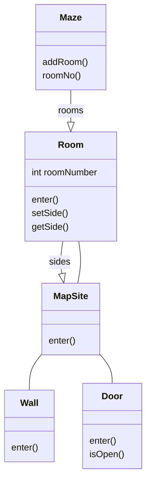

# Maze game

Same problem with different creational patterns. 

You can see code with smells in MazeGame.class 

Dirty code work but has several problems in the next step of future implementations.
Below the class diagram of this simple project 

It's not important the real implementation but it's important to have a general point of view of project.
The real problem with this code isn't complexity but is *inflexibility*. Changing the layout means changing this member function, either overriding it; which means reimplementing all the whole thing.

Now the next question is:
Suppose you wanted to reuse an existing maze layout for a new game containing enchanted mazes. 
The enchanted maze game ha new kinds of components, like DooorNeedingSpeel(a door can be locked and opened only with magic spell) and EnchantedRoom (room with a special item inside, like magic key or spell).
How can you change CreateMaze easily so that it creates mazes with these new class objects?

In this case the biggest barrier to change lies in hard coding the classes that get instantiated.

The creational pattern provide different ways to remove explicit references to concrete classes from the code that need to instantiate them:

- if CreateMaze calls virtual functions instead of constructor calls to create the rooms, wall, and doors it requires, then you can change the classes that get instantiated by making a subclass of MazeGame and redefining those virtual functions. [This approach is an example of Factory Method](/abstract-factory)
- if CreateMaze is passed an object as parameter to use to create rooms, wall, and doors, then you can change the classes of rooms, walls, and doors by passing a different parameter. [This is an example of the abstract Factory pattern.](factory-method)
- if CreateMaze is passed an object that can create a new maze in its entirety using operations for adding rooms, doors and walls to the maze it builds, then you can use inheritance to change parts of the maze or the way the maze is built. [This is an example of builder pattern.](builder)
- if CreateMaze is parameterized by various prototypical room, door, and wall objects, wich it the copies and adds to the maze, then you can change the maze's composition by replacing these prototypical object with different ones. [This is an example of prototype pattern.](prototype)

