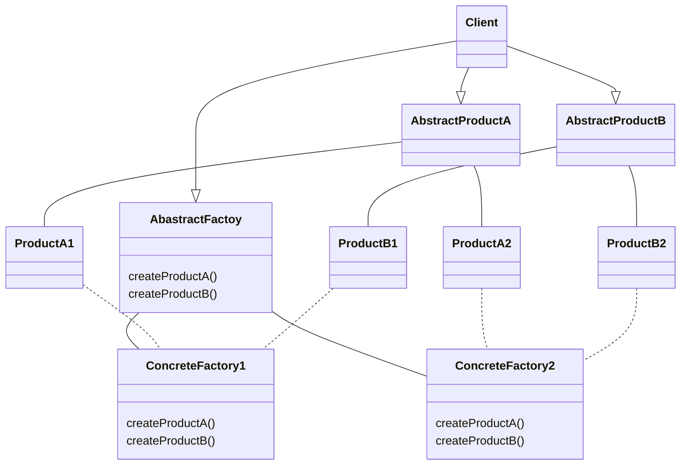

# Abstract factory

### intent 
provide an interface for creating families of related or dependent objects without specifying their concrete classes

### Applicability
Use the Abstract Factory pattern when

- a system should be independent of how its products are created, composed and represented.
- a system should be configured with one of multiple families of products
- a family of related product objects is designed to be used together, and you need to enforce this constraint
- you want to provide a class library of products, and you want to reveal yous their interface, not their implementation

### Participants 

- AbstractFactory
- ConcreteFactory
- AbstractProduct
- ConcreteProduct
- Client

### Consequences

- It isolates concrete classes
- It makes exchanging product families easy
- It promotes consistency among products
- Supporting new kinds of products is difficult



Java implementation preview of [MazeGame.java](src%2Fmain%2Fjava%2Forg%2Fexample%2FMazeGame.java)
```java
public static void main(String[] args) {
        Maze simpleMaze = buildMaze(new MazeFactory());
        Maze mazeWithBomb = buildMaze(new BombedMazeFactory());
        Maze enchantedMaze = buildMaze(new EnchantedMazeFactory());
}

public static Maze buildMaze(Factory mazeFactory){
        Maze maze = mazeFactory.createMaze();

        Room r1 = mazeFactory.createRoom(1);
        Room r2 = mazeFactory.createRoom(2);

        Door theDoor = mazeFactory.createDoor(r1, r2);
        maze.addRoom(r1);
        maze.addRoom(r2);

        r1.setSide(North, mazeFactory.createWall());
        r1.setSide(East, theDoor);
        r1.setSide(North, mazeFactory.createWall());
        r1.setSide(North, mazeFactory.createWall());

        r2.setSide(North, mazeFactory.createWall());
        r2.setSide(East, theDoor);
        r2.setSide(North, mazeFactory.createWall());
        r2.setSide(North, mazeFactory.createWall());
        return maze;
}
```