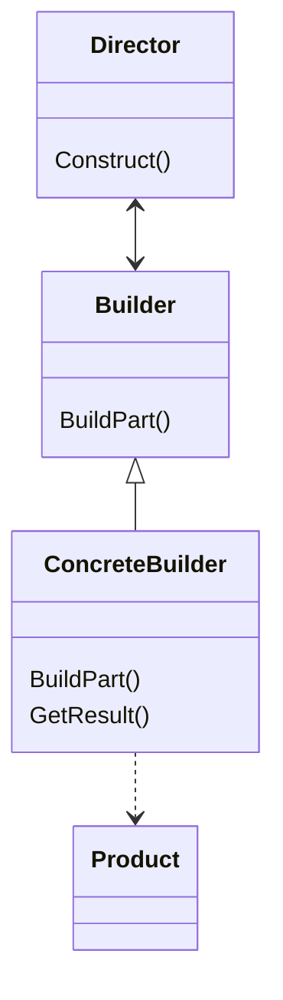
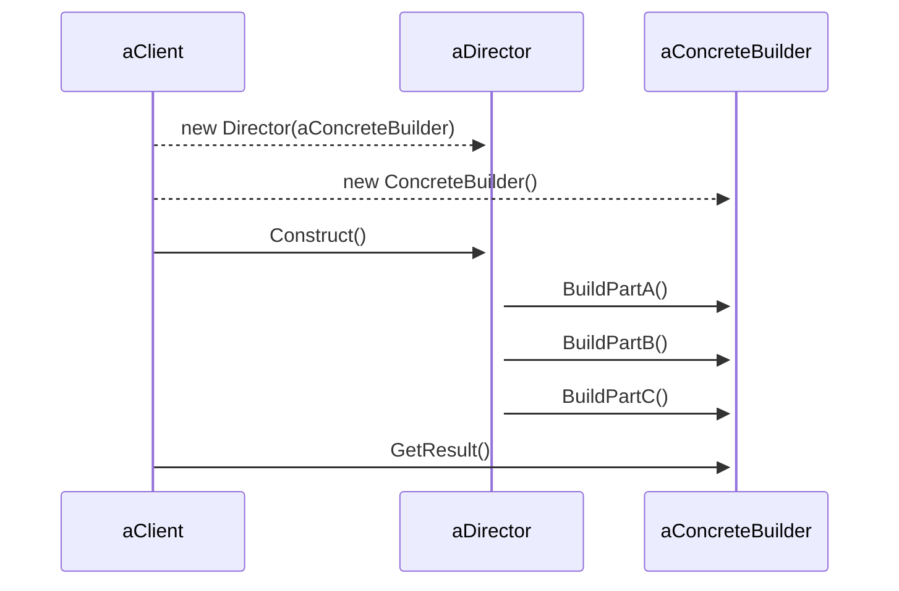

# Builder

### intent
Separate the construction of a complex object from its representation so that the same construction process can create a different representations

### Applicability
Use the Builder pattern when

- the algorithm for creating a complex object should be independent of the parts that make up the object and how thery're assembled
- the construction process must allow different representations for the object that's constructed

### Participants

- Builder
- ConcreteBuilder 
- Director
- Product

### Consequences

- it lets you vary a product's internal representation
- it isolates code for construction and representation
- it gives you fine; control over the construction process

### Structure

### Relations

