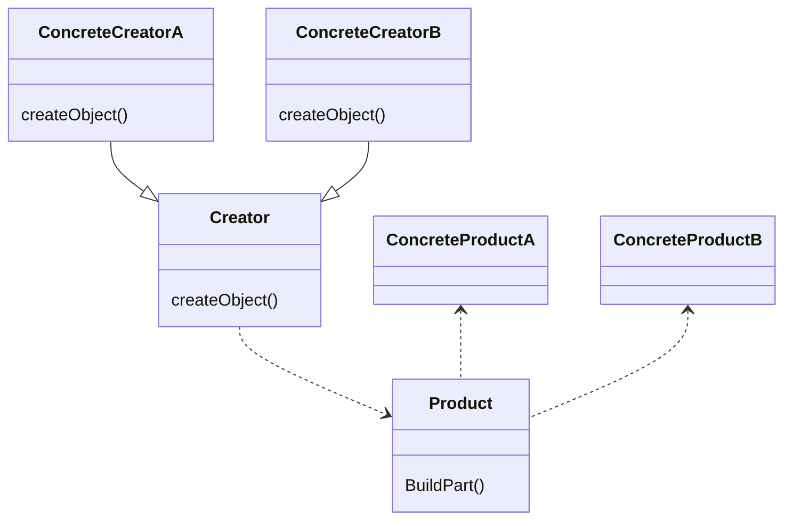

# Factory Method

### intent
Define an interfae for creating an object, but let subclasses decide which class to instantiate. Factory Method lets a class defer instantiation to subclasses.

### Applicability
Use the Factory Method pattern when

- a class can't anticipate the class of objects it must create
- a class wants its subclasses to specify the objects it creates
- classes delegate responsibility to one of several helper subclasses, and you want to localize the knowledge of which helper subclass is the delegate

### Participants

- Product
- ConcreteProduct
- Creator
- ConcreteCreator

### Consequences

- provides hooks for subclasses 
- connects parallel class hierarchies
- it gives you fine; control over the construction process

### Structure

