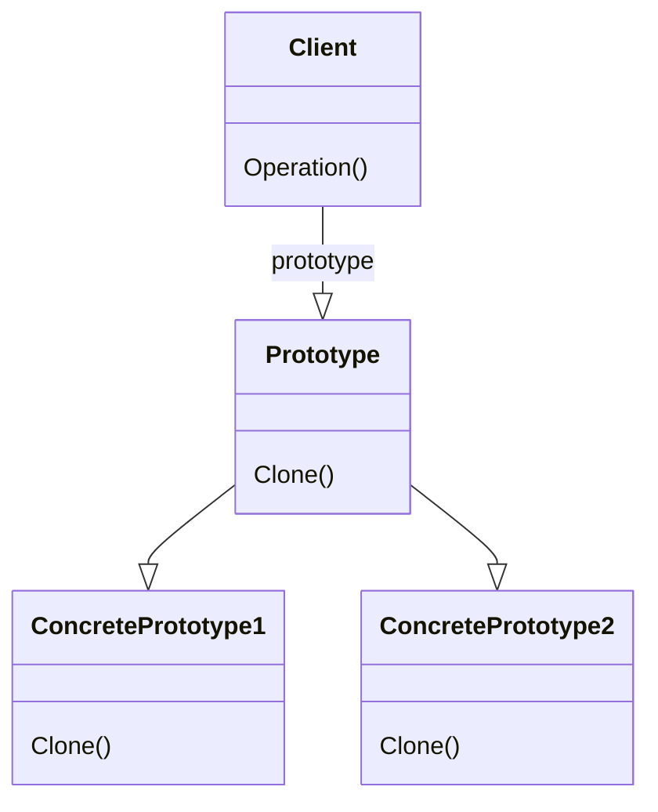

# Prototype 

### Intent
specify the kinds of objects to create using a prototypical instance, abd create new objects by copying this prototype 

### Applicability
Use the Prototype pattern when a system should be independent of how its products are created, composed, and represented AND

- when the classes to instantiate are specified at run-time, for example, by dynamic loading; or
- to avoid building a class hierarchy of factories that parallels the class hierarchy of products; or
- whe  instances of a class can have one of only a few different combinations of state. It may be more convenient to install a corresponding number of prototypes and clone them rather than instantiating the class manually, each time with the appropriate state.

### Participants

- Prototype
- ConcretePrototype
- Client

### Consequences

- Adding and removing products at run-time
- specifying new objects by varying values
- specifying new objects by varying structure
- reduced subclassing 
- configuring an application with classes dynamically

